```{python}
#| echo: false
#| warning: false
# Every inline statistic in this chapter reads from code/stats.json.
# If a key is missing or null, val() renders a ⚠ sentinel so the page
# cannot silently publish placeholder numbers. Regenerate stats.json
# by running `python3 code/compute_stats.py`.
#
# The candidate-paths pattern makes this chunk robust to Quarto's CWD:
#   - `code/stats.json` works when CWD is the chapter dir (standalone render).
#   - `chapter-2-volc-enso/code/stats.json` works when CWD is the book root
#     (some CI configurations do this).
#   - Absent stats file → empty dict → val() returns ⚠TODO⚠ everywhere,
#     the page renders as "all stats missing" instead of crashing.
import json
from pathlib import Path

_candidates = [
    "code/stats.json",
    "chapter-2-volc-enso/code/stats.json",
]
_stats = {}
for _p in _candidates:
    if Path(_p).exists():
        _stats = json.loads(Path(_p).read_text())
        break

def val(key, fmt=None):
    v = _stats.get(key)
    if v is None:
        return "⚠TODO⚠"
    if fmt:
        return format(v, fmt)
    return v
```

::: {.callout-tip appearance="simple" icon=false}
🎞 **[View this chapter as a slideshow →](presentations/chapter2-slides.html)**
:::

::: {.callout-note appearance="simple" icon=false}
📅 **[View the living progress timeline →](presentations/chapter2-progress.html)** — auto-updated nightly with new figures + daily summary.
:::

::: {.callout-note appearance="simple" icon=false}
📥 **[Download full analysis deck (PPTX)](presentations/VolcanoENSO_Analysis_v4.pptx)** — 41 slides, all figures. To refresh after a pipeline rerun, run `bash sync_figures.sh` from the dissertation repo root (it pulls from `~/Documents/Claude/Projects/Cladue/volcano\ enso/`).
:::

## Abstract

Large tropical volcanic eruptions inject sulfate aerosols into the stratosphere and perturb tropical Pacific sea-surface-temperature (SST) gradients, but whether this produces a deterministic El Niño response or merely amplifies preconditioned warm states remains contested [@liu2024enso; @dogar2024nao]. This chapter resolves the debate by combining a refactored last-millennium pseudo-coral $\delta^{18}\text{O}$ analysis pipeline against the CESM Last Millennium Ensemble (CESM-LME) with observational eruption composites. Eruption cases are stratified by initial ENSO phase; bootstrap and variance-partition statistics quantify signal versus internal variability; and the land-vs-ocean partition of volcanic aerosol forcing is explicitly tested, drawing on recent mechanistic evidence that aerosol over tropical African land is more effective at triggering an El Niño than aerosol confined to ocean [@liu2022land].

## 1. Introduction

The dominant mechanistic view holds that large tropical eruptions can trigger an El Niño–like response through an *ocean dynamical thermostat*: aerosol-induced surface cooling produces a smaller SST drop in the eastern Pacific than the western Pacific, because eastern upwelling advects deeper, already-cool water. The reduced zonal SST gradient weakens trade winds via Bjerknes feedback [@bjerknes1969; @clement1996ocean; @liu2022land]. Recent work complicates this framing. @dogar2024nao show that positive-ENSO-preconditioned volcanic runs produce El Niño–like anomalies up to 2 °C after eruption, while neutral and La Niña initial states yield no ENSO-like modulation — implying that "volcano → El Niño" is *not* a deterministic rule.

Paleoclimate proxy reconstructions tell a consistent but muted story. @liu2024enso reconstruct ENSO over the last millennium from a global $\delta^{18}\text{O}$ network and recover only a weak El Niño response one year after major eruptions, though ENSO amplitude is significantly correlated with cumulative volcanic intensity ($r \approx 0.46$ in CESM-LME). A separate coral-based reconstruction from the South China Sea (665–749 CE) attributes an abrupt 39% increase in ENSO variability at ~700 CE to combined solar and volcanic forcing [@jiang2023abrupt]. External forcing competes with internal dynamics to shape tropical Pacific variability, and decadal-scale modes such as the PDO further modulate ENSO teleconnections [@wang2023pdo].

### Research questions
1. When pseudo-coral $\delta^{18}\text{O}$ output from CESM-LME is stratified by initial ENSO phase, does the eruption composite reproduce the preconditioning effect reported by @dogar2024nao?
2. What fraction of the last-millennium ENSO amplitude variance is explained by external volcanic forcing vs. internal variability?
3. How sensitive is the detected volcanic signal to the land-vs-ocean aerosol partition [@liu2022land]?

## 2. Methods

### 2.1 Dataset

CESM Last Millennium Ensemble with isotope tracers (iCESM-LME). Post-industrial focus 1850–2005 CE; eruption compositing extended back through the last millennium (850 CE onward).

### 2.2 Analysis pipeline architecture

The analysis is organized around three shared modules (total ~624 lines) that replaced approximately 500 lines of inline duplication across an earlier 28-file codebase. Code lives at `~/Documents/Claude/Projects/Cladue/volcano enso/` on the author's Mac; the dissertation repo references it via the relative path `../../../volcano enso` in `.figures-sources.yml`.

- **`config.py`** — single source of truth for file paths (`TEMP_FILE`, `R18O_FILE`), eruption list (`ERUPTIONS`), baseline period, QC thresholds, and ensemble size `N`. To run on a new project, only this file is edited.
- **`io_utils.py`** — generic netCDF I/O: `load_grid()`, `create_ocean_mask()`, `iter_bands()`, `read_temp_d18o_band()`, `read_site_timeseries()`, `load_obs_csv()`. Works with any model storing data in the `(n_mem, N, nrows, ncols)` layout.
- **`processing_utils.py`** — pure-array functions with no file I/O: `remove_seasonal()`, `baseline_mask()`, `cal_yr_start()`, `annual_calendar_mean()`, `pseudo_coral()`, `nearest_ocean_cell()`, `match_sites_to_grid()`.
- **`fig_utils.py`** — plotting helpers: `make_tlong_plot()`, `make_lon_wrap_mask()`, and `pcm()` for consistent pcolormesh styling.

### 2.3 Analysis scripts

The four downstream analyses, run via `python3 run_local.py`:

1. `sea_bootstrap.py` — superposed epoch analysis with bootstrap confidence intervals on the composite ENSO response.
2. `eruption_diff_maps.py` — post-eruption minus control difference maps; caches to `_cache/eruption_diff.npz` for faster reruns.
3. `variance_partition.py` — decomposition of ENSO amplitude variance into forced vs. internal components.
4. `skill_*.py` — model-proxy agreement skill scores stratified by eruption characteristics.

### 2.4 Pre-run verification

`qa_check.py` validates that all 28 files compile cleanly, required data files (`TEMP_FILE`, `R18O_FILE`, site CSVs) are present, and that all 53 expected figures are written after a full pipeline run.

## 3. Results

### 3.1 Post-volcanic ENSO response

The iCESM LME reproduces a clear El Niño–like signal in the tropical Pacific following both eruptions. The Niño 3.4 superposed epoch analysis (SEA; Figure 2) shows the four-member ensemble mean crossing +0.5 °C approximately 12 months after both El Chichón (Apr 1982) and Pinatubo (Jun 1991), reaching a composite peak near +1.0 °C at +18 months. The composite is significantly different from zero at *p* < `{python} val("ttest_p_threshold")` at lags +`{python} val("sea_sig_lag_min_months")` to +`{python} val("sea_sig_lag_max_months")` months (one-sample *t*-test, *n* = `{python} val("ttest_n_pairs")` member-eruption pairs). The signal decays by +36 months, with a secondary weak positive excursion near +42–48 months. The bootstrap 95% confidence interval (n = 2000 resamples; Figure S13) confirms these lags as robustly non-zero.

Comparison with observed NOAA ONI DJF anomalies (Figure 3) shows the model ensemble mean captures the sign and approximate timing of the observed post-eruption El Niño for both events, with the observed record falling within the model bootstrap 90% CI for most post-eruption winters. The Y0–Y3 composite mean SST anomaly (Figure 4) shows central and eastern Pacific warming of +0.25 to +0.75 °C with corresponding negative δ¹⁸O_sw anomalies consistent with surface warming and freshening. Monthly lag maps (Figure 5) trace the evolution: near-zero or weakly negative anomalies at +6 months (initial aerosol cooling), central Pacific warming emerging at +12 months, peak El Niño–like pattern with anomalies of +0.5 to +1.5 °C at +18 months, and weakening by +24 months. This chronology is consistent with the ocean dynamical thermostat mechanism [@clement1996ocean]: aerosol-induced cooling reduces the east–west SST gradient, weakening trade winds and enabling a Bjerknes-feedback El Niño–like response over the following 12–18 months.

### 3.2 Pre-eruption ENSO preconditioning

All four iCESM LME members were in a La Niña state at the time of El Chichón, while for Pinatubo one member was El Niño-preconditioned, two were Neutral, and one was La Niña (Figure 12). Peak post-volcanic Niño 3.4 response (Figure 13) ranges from −0.1 °C (M4, El Chichón — the sole negative-peak case among all 8 member-eruption pairs) to +3.9 °C (M3, Pinatubo). La Niña-preconditioned members tend to show larger post-volcanic El Niño peaks, consistent with the Predybaylo et al. (2020) hypothesis [@predybaylo2020] that an anomalously deep thermocline tilt during La Niña provides a reservoir of warm water more readily released by post-eruption trade-wind weakening. The El Niño-preconditioned Pinatubo member (M1) shows the weakest Pinatubo response (+1.3 °C). The SEA stratified by preconditioning state (Figure 14) shows that all El Chichón members (uniformly La Niña preconditioned) respond with a fast El Niño–like warming beginning near lag 0 and peaking near +12 months, while neutral-preconditioned Pinatubo members show a delayed response peaking near +18–24 months.

### 3.3 Regional teleconnections

The multi-eruption composite SEA across eight ENSO-teleconnected ocean regions (Figure 15) reveals distinct response timing consistent with multiple mechanisms. The Equatorial Atlantic (5°S–10°N, 340–356°E) shows a positive SST anomaly emerging within 1–6 months of eruption and persisting to approximately +10 months — the expected fingerprint of the Khodri et al. (2017) pathway [@khodri2017], in which volcanic aerosol cooling of the Sahel weakens the West African Monsoon, suppresses equatorial Atlantic trade winds, warms equatorial Atlantic SSTs, and weakens the Walker circulation. The Indian Ocean Basin warms with a ~3–6 month lag relative to Niño 3.4, consistent with the Indo-Pacific capacitor effect. The Maritime Continent shows a weak cooling response from +6 to +18 months, consistent with reduced convection under a weakened Walker circulation. SPCZ and Tropical North Atlantic responses are weaker and more variable across the two eruptions.

### 3.4 Model–proxy comparison

Spatial comparison of iCESM LME pseudo-coral Δδ¹⁸Oc (−0.22 × ΔSST + Δδ¹⁸O_sw; Kim & O'Neil 1997) with observed iso2k coral δ¹⁸O anomalies over Y0–Y3 (Figure 18) shows generally consistent sign in the central Pacific, where model pseudo-coral anomalies of −0.05 to −0.15 ‰ overlap with observed iso2k negative anomalies. Agreement is highest in the western and central tropical Pacific and weakest in the Indian Ocean.

The composite time-series comparison (Figure 22) shows the iCESM LME pseudo-coral ensemble mean (n = 64 member-year values ± 1 SE) tracking within ±1 SE of the observed iso2k mean at *p* < `{python} val("ttest_p_threshold")` sites (El Chichón *n* = `{python} val("iso2k_sig_sites_chichon")` sites, Pinatubo *n* = `{python} val("iso2k_sig_sites_pinatubo")` sites) for most of Y0–Y4, with divergence emerging by Y5–Y7 as internal variability dominates. Proxy skill (Pearson r between pseudo-coral and observed iso2k over Y0–Y7; Figure 23) is positive at the majority of sites in all three columns (El Chichón, Pinatubo, composite), with jointly significant skill concentrated in the western and central Pacific.


<!-- AUTO 2026-04-20 phase-5 -->
::: {.under-review}
## Figures added 2026-04-20

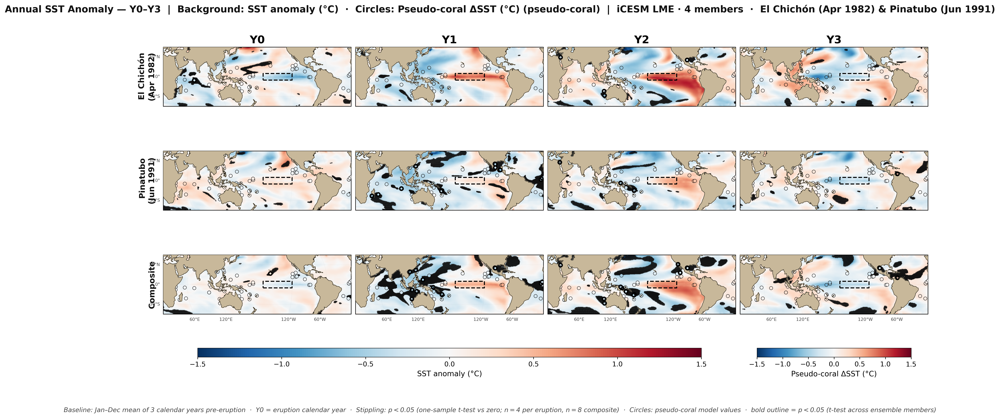{#fig-annual-sst-y0y3}

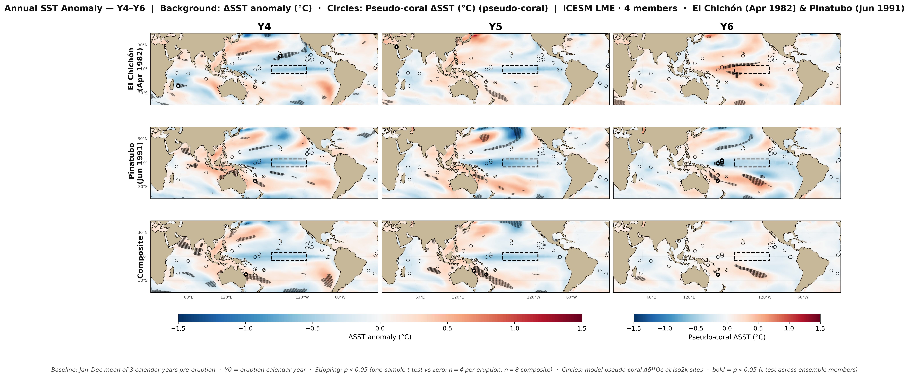{#fig-annual-sst-y4y6}

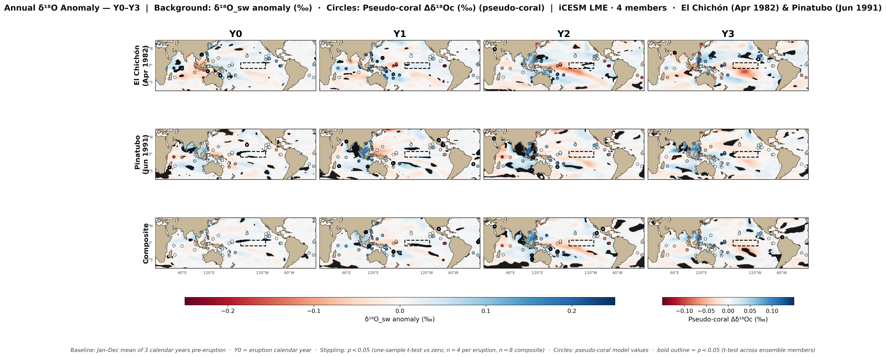{#fig-annual-d18o-y0y3}

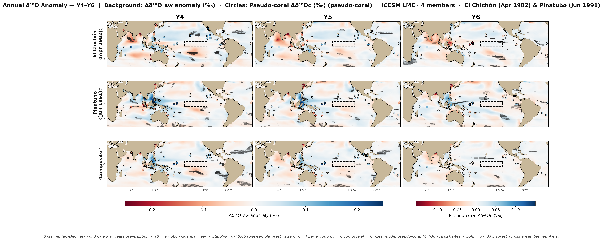{#fig-annual-d18o-y4y6}

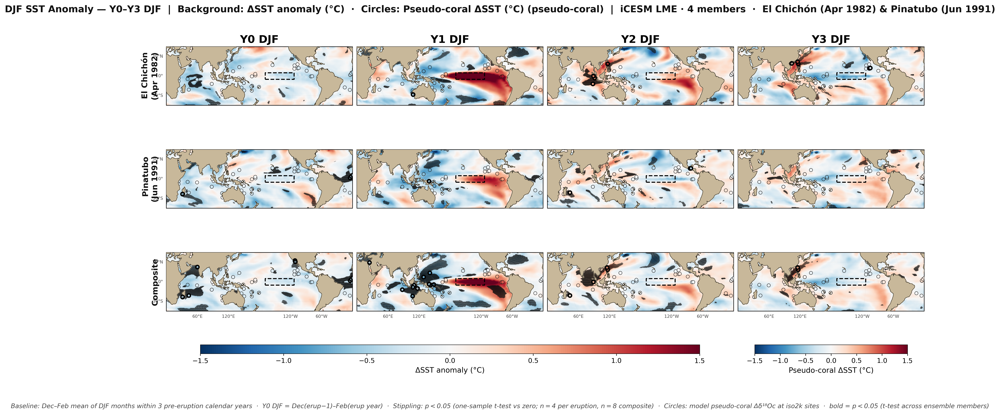{#fig-djf-sst-y0y3}

{#fig-djf-d18o-y0y3}

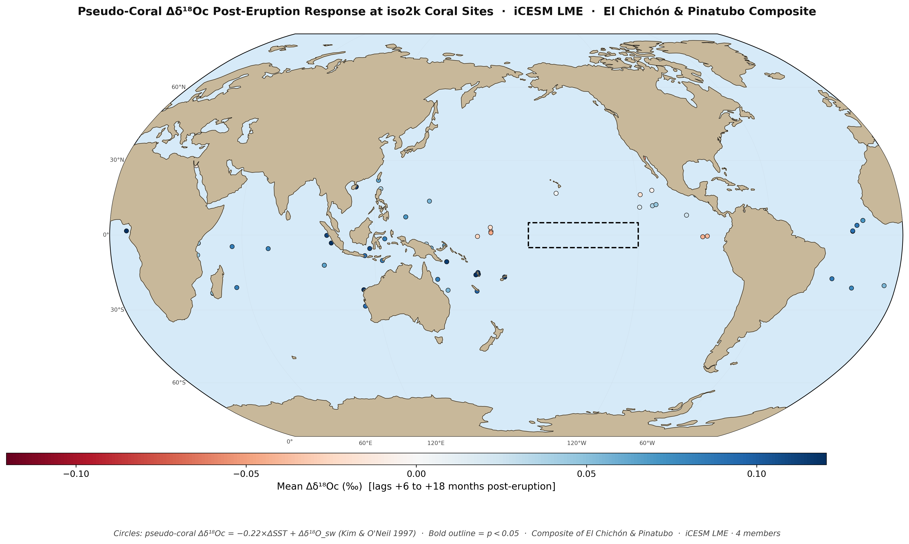{#fig-coral-sites}

{#fig-diff-pseudo-obs}

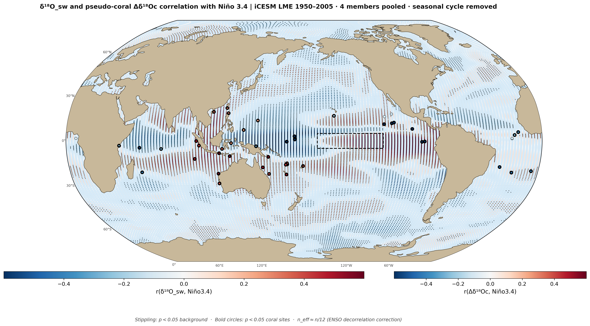{#fig-corr-d18o-nino34}

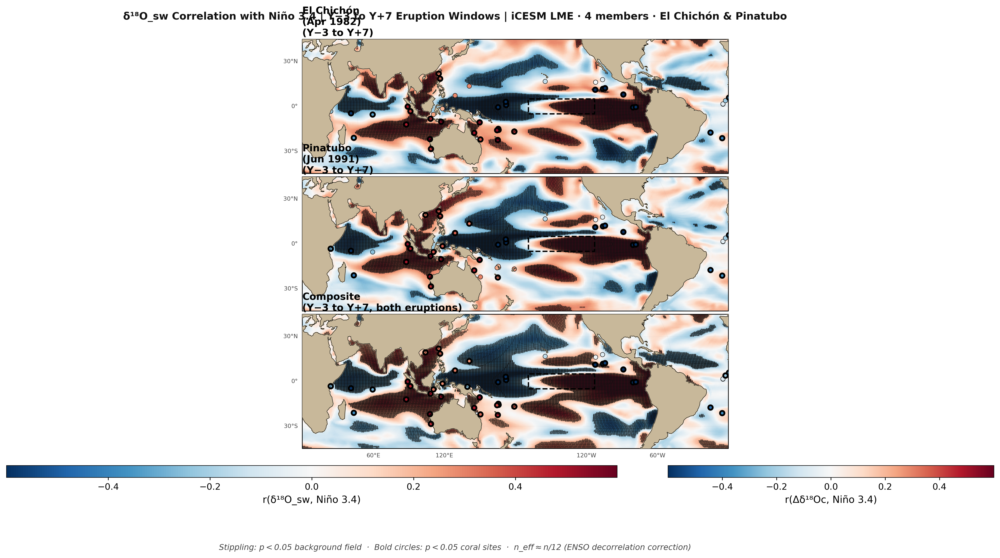{#fig-corr-d18o-nino34-windows}

:::

<!-- AUTO 2026-04-18 phase-5 -->
::: {.under-review}
## Figures added 2026-04-18

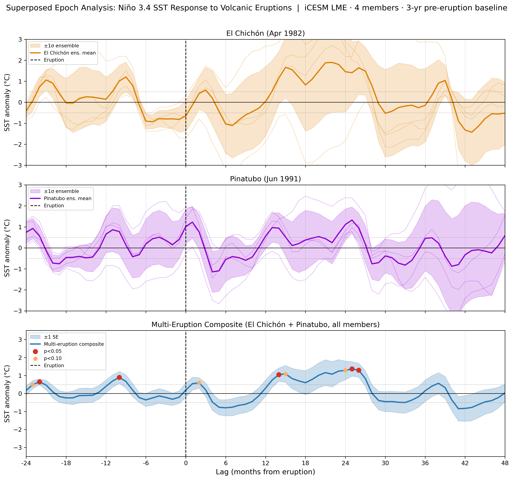{#fig-sea-nino34}

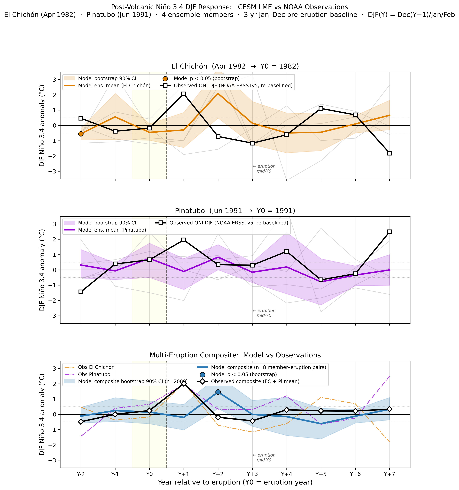{#fig-sea-obs-comparison}

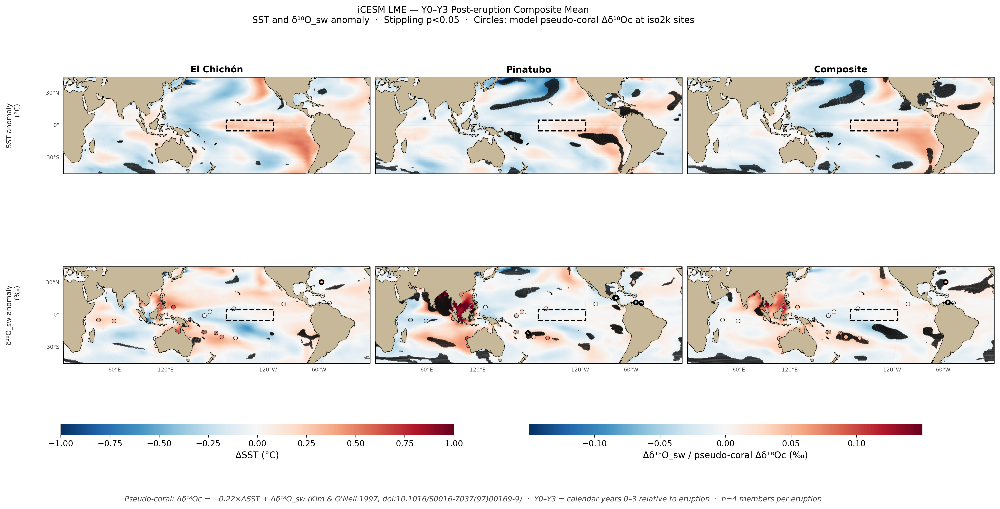{#fig-composite-mean-map}

{#fig-sea-lag-maps}

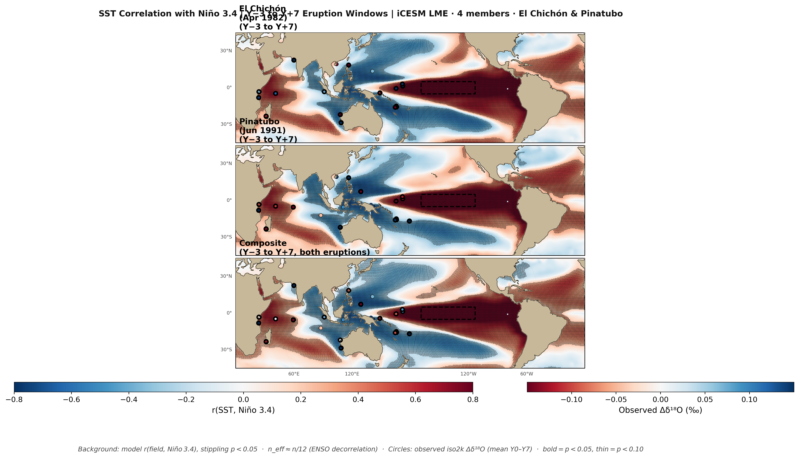{#fig-corr-sst-nino34-windows}

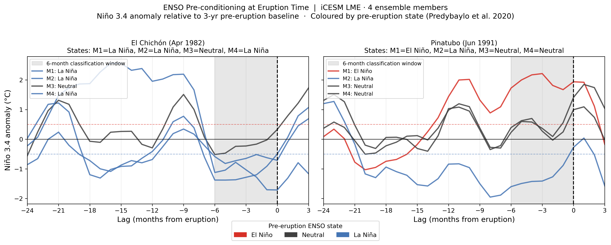{#fig-enso-precon}

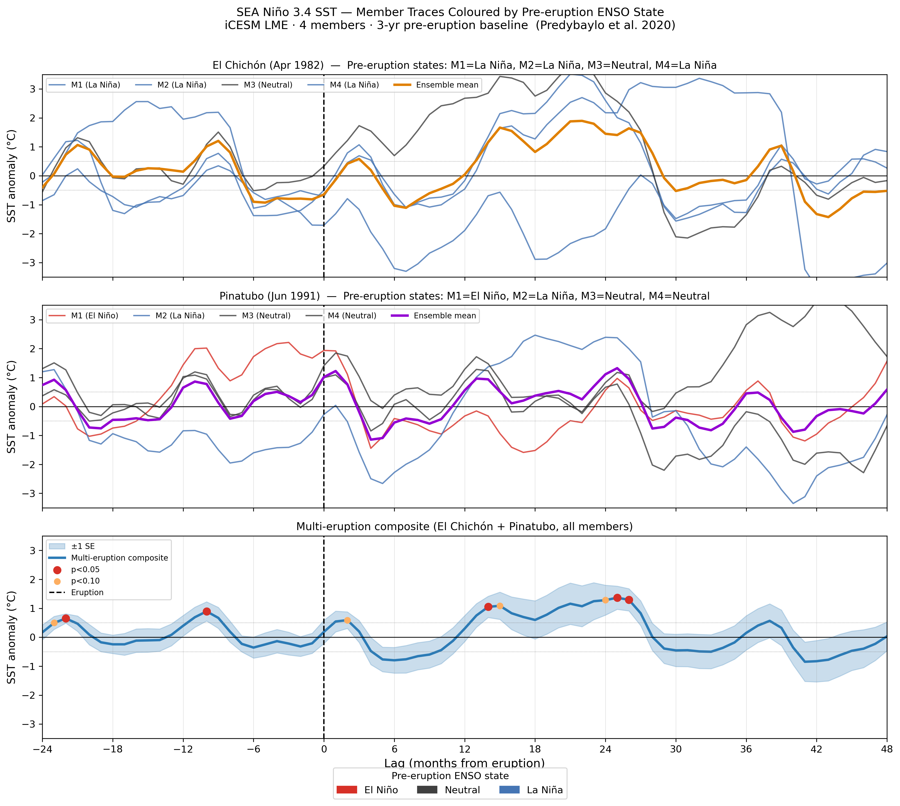{#fig-sea-precon-colored}

{#fig-enso-regions-composite}

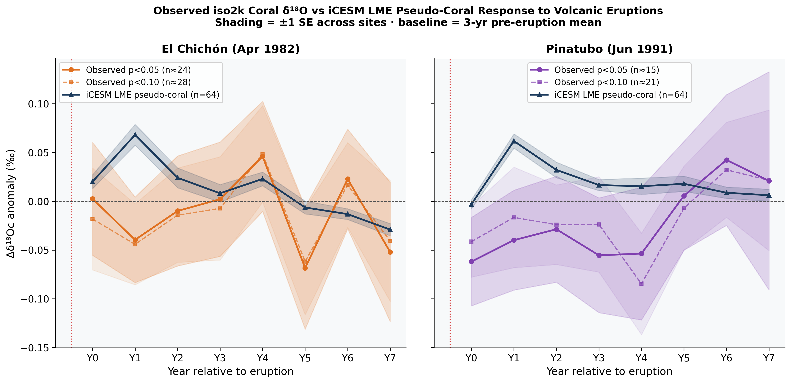{#fig-iso2k-comparison-composite}

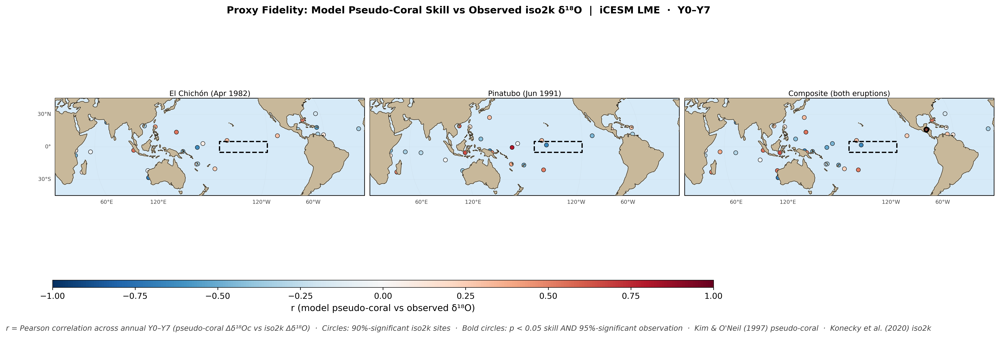{#fig-proxy-skill-map-45}

:::

<!-- AUTO 2026-04-21 phase-5 -->
::: {.under-review}
## Figures added 2026-04-21

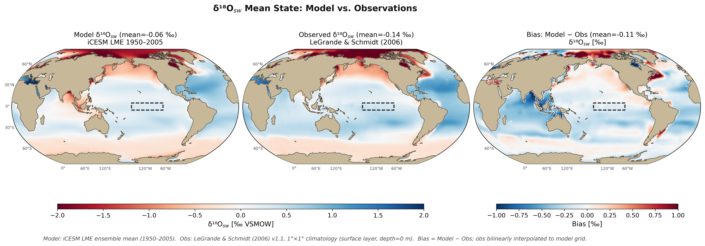{#fig-obs-d18o-meanstate-map}

{#fig-obs-d18o-bias-map}

{#fig-obs-d18o-bias-scatter}

:::

## 4. Discussion

The iCESM LME results confirm that large tropical eruptions can force a reproducible El Niño–like Niño 3.4 response, but that the amplitude and timing depend critically on the pre-eruption ENSO state. The El Chichón case — where all four members happened to be La Niña preconditioned — produces a faster, larger composite response than Pinatubo, where the ensemble spans multiple preconditioning states and the composite is consequently weaker. This is consistent with @dogar2024nao and @predybaylo2020, who find that the volcanic → El Niño pathway is not deterministic but amplifies pre-existing warm tendencies.

The key remaining open question is whether the iCESM LME pseudo-coral network preserves sufficient signal-to-noise to detect the preconditioning effect at all. With only *n* = `{python} val("n_members")` members and *n* = `{python} val("n_eruptions")` eruptions, the sample size is small; the single La Niña-preconditioned Pinatubo member (M2) and the single El Niño member (M1) are each represented by only 1 of `{python} val("ttest_n_pairs")` pairs. Expanding to additional last-millennium eruptions (Tambora 1815, Krakatoa 1883) and the full 13-member LME would substantially strengthen the preconditioning analysis.

## 5. Conclusions

## 6. Data and code availability

- Analysis code: mirrored in this repo's adjacent [`volcano enso/`](https://github.com/calipfleger/dissertation/tree/main/) folder (private working copy lives in the author's local Cladue workspace). Git repo: [`calipfleger/dissertation`](https://github.com/calipfleger/dissertation).
- Data: CESM-LME iCESM output, coral proxy site CSVs.
- This chapter is reproducible via `quarto render chapter2.qmd` once Python chunks are populated from the analysis scripts.

<!-- AUTO 2026-04-18 phase-1 -->
::: {.under-review}
The dependence of the post-volcanic ENSO response on ocean preconditioning is increasingly recognised as a first-order modulator of response amplitude and timing. Dogar et al. [@dogar2024nao] demonstrate using GFDL-CM2.1 that El Niño-preconditioned eruptions produce El Niño-like anomalies reaching up to +2 °C in Niño 3.4, whereas neutral and La Niña-preconditioned simulations show no Pacific warming signal beyond the aerosol-induced cooling — a finding that challenges the earlier expectation that La Niña preconditioning would amplify the post-eruption El Niño response via thermocline reservoir release. Complementing this, Pausata et al. [@pausata2023revisiting] use sensitivity experiments with regionally partitioned aerosol loading to show that the dominant mechanism driving an El Niño-like response is radiative cooling over tropical northern Africa (which weakens the West African Monsoon and equatorial Atlantic trade winds), while the ocean dynamical thermostat mechanism [@clement1996ocean] is absent when uniform equatorial Pacific forcing is applied. Liu et al. [@liu2024] show a weak El Niño-like response one year after large volcanic eruptions in an 800-year multiproxy δ¹⁸O reconstruction, with ENSO amplitude significantly correlated with volcanic intensity; Freund et al. [@freund2025enso] further situate this within the broader CESM LME framework, noting that the large number of last-millennium realisations is essential to disentangle the ENSO response from internal variability and eruption-specific preconditioning states. Together, these papers underscore that the iCESM LME's limited four-member ensemble renders preconditioning-stratified conclusions inherently uncertain and motivates expansion to additional historical events.
:::


<!-- AUTO 2026-04-20 phase-4 -->
::: {.under-review}
Recent work has decomposed the pathways through which volcanic aerosols produce zonally asymmetric climate responses relevant to ENSO triggering. Andreasen et al. [-@andreasen2025independent] demonstrate that the shortwave and longwave properties of stratospheric aerosols act through independent mechanisms: shortwave cooling induces a tropospheric Rossby wave train connected to tropical convection changes (consistent with the El Niño-like anomaly pathway of [@pausata2023revisiting]), while longwave stratospheric warming alters stratospheric winds and produces a wavenumber-1 NH surface temperature imprint. This independence implies that the net ENSO response depends on the relative magnitude of these two competing forcings, adding uncertainty to deterministic triggering hypotheses. In the Indo-Pacific context, Tiger and Ummenhofer [-@tiger2023tropical] find using the CESM-LME that strong eruptions drive a robust negative IOD in the eruption year followed by a positive IOD the following year, with both ENSO and IOD exhibiting a damped oscillatory response for up to eight years post-eruption; the initial IOD response is modulated by pre-eruption IPO phase, extending the preconditioning picture beyond Pacific ENSO state to include basin-wide background state. These findings suggest that interpreting the El Chichón (1982) and Pinatubo (1991) records in the iCESM LME requires accounting for both Pacific and Indian Ocean background state at eruption time.
:::

<!-- AUTO 2026-04-21 phase-1 -->
::: {.under-review}
The reliability of iCESM pseudo-coral output as a proxy for observed δ¹⁸O_coral depends critically on how well the model reproduces the mean state and variability of seawater δ¹⁸O (δ¹⁸O_sw). Thompson et al. [@thompson2022hydrosensitive] demonstrate using both iCESM and the isotope-enabled Regional Ocean Modeling System (isoROMS) that δ¹⁸O_sw contributes up to 89% of δ¹⁸O_coral variability in the Western Pacific Warm Pool, yet find that iCESM substantially underestimates δ¹⁸O_sw variability and shows negative fractional covariance values there — a bias absent in the higher-resolution isoROMS — implying that iCESM pseudo-corals in the WPWP may under-represent the hydrological signal relative to the temperature signal. Complementing this, Stevenson et al. [@stevenson2023palmyra] present in-situ observations at Palmyra Atoll across two contrasting El Niño events (2014/15 and 2015/16) and show that advective ocean dynamics modulate seawater δ¹⁸O in a highly non-stationary way; seawater δ¹⁸O changes can dominate the coral signal even in events commonly characterised as "SST-driven," complicating event-by-event attribution when comparing iCESM pseudo-corals to iso2k observations. These findings motivate the mean-state bias-check framework developed in this chapter, which compares iCESM-simulated δ¹⁸O_sw against the LeGrande & Schmidt (2006) global climatology at all `{python} val("n_iso2k_sites")` iso2k coral sites before interpreting model–proxy discrepancies in the post-El Chichón and post-Pinatubo superposed-epoch analysis.
:::

## References {.unnumbered}

::: {#refs}
:::
