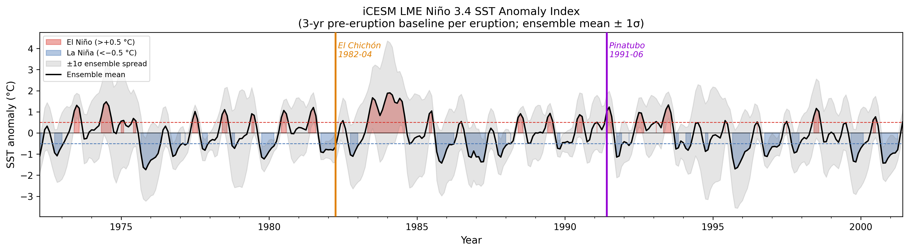
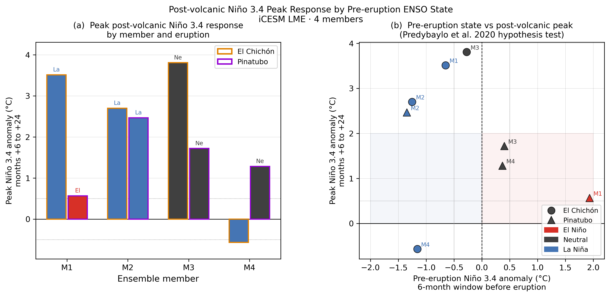

## How this deck works {.smaller}

This is a **living timeline** of progress on Chapter 2.

- The nightly pipeline appends a date-stamped section after midnight every day.
- Each daily section includes a short summary of what was worked on plus any new figures.
- Newest entries appear at the **bottom** — navigate forward (→) through time, backward (←) for older.

For the curated talk version, see [chapter2-slides.html](chapter2-slides.html).

## Status legend

- ✅ figure finalized for chapter
- 🔄 figure under iteration
- ⚠ result preliminary, do not cite

. . .

The "What we did" lines are pulled from the daily-summaries the nightly loop writes; figures are mirrored from `chapter-2-volc-enso/figures/`.

# Timeline {.center}

_New entries auto-appended below this divider every night._

<!-- PROGRESS-INSERT-MARKER — phase 5 of the nightly pipeline appends new sections HERE -->

# 2026-04-18 {.center}

## What we did

- Synced 148 analysis figures from the volcano-ENSO analysis folder (at `~/Documents/Claude/Projects/Cladue/volcano enso/` since the 2026-04-19 move into the Cladue workspace) into the dissertation repo via `sync_figures.sh`.
- Wired two slideshows per chapter: curated `chapterN-slides.qmd` (hand-edited) and this living `chapterN-progress.qmd` (auto-appended nightly).
- Built `build.sh` — one command that runs `sync_figures.sh`, renders the book + slideshows, and copies everything into `_book/` so the "View as slideshow →" links resolve on the published site.
- Verified all 14 slideshow figure references in `chapter2-slides.qmd` resolve to files in `figures/`.
- Verified all 7 citations in `chapter2.qmd` and `chapter2-slides.qmd` resolve to `bibliography.bib`.

## New figures today (14)

All 14 canonical Ch2 figures are now synced into `figures/` and mirrored here. Each slide below follows the same caption framing as the curated talk deck [@clement1996ocean; @liu2022land; @liu2024enso; @dogar2024nao; @jiang2023abrupt; @wang2023pdo; @bjerknes1969]. ⚠ all preliminary.

## Fig 1 — Niño 3.4 index (iCESM LME)

{.r-stretch}

## Fig 2 — Post-volcanic ENSO response (SEA composite)

![Core result: composite Niño 3.4 shows El Niño–like warming peaking ~12–18 months post-eruption across both study eruptions [@clement1996ocean]. ⚠ preliminary.](../figures/sea_nino34.png){.r-stretch}

## Fig 3 — Model vs. observed ONI

{.r-stretch}

## Fig 4 — Spatial structure (Y0–Y3 composite)

{.r-stretch}

## Fig 5 — Monthly lag evolution

![SST at +6, +12, +18, +24 months post-eruption; El Niño–like central/eastern Pacific warming builds through +12 and peaks near +18 months [@liu2022land]. ⚠ preliminary.](../figures/sea_lag_maps.png){.r-stretch}

## Fig 6 — Annual SST Y0–Y3

{.r-stretch}

## Fig 10 — ENSO correlation within eruption windows

{.r-stretch}

## Fig 12 — Pre-eruption ENSO state per member

{.r-stretch}

## Fig 13 — Peak response vs. pre-conditioning

{.r-stretch}

## Fig 14 — Pre-conditioning SEA

{.r-stretch}

## Fig 15 — Regional teleconnections

{.r-stretch}

## Fig 18 — Model–proxy spatial comparison (Y0–Y3)

![Background: model pseudo-coral δ¹⁸O field. Circles: observed iso2k δ¹⁸O at 89 tropical sites. Bold outlines p < 0.05 [@liu2024enso]. ⚠ preliminary.](../figures/pseudo_vs_obs_map_y0y3.png){.r-stretch}

## Fig 22 — Model–proxy time series (composite)

{.r-stretch}

## Fig 23 — Proxy skill map

{.r-stretch}

## Open questions (tomorrow)

- Variance partition (forced vs. internal) of ENSO amplitude over the last millennium [@jiang2023abrupt; @wang2023pdo].
- Expand eruption set beyond El Chichón + Pinatubo.
- Systematize pseudo-coral signal-to-noise testing against the Bjerknes framework [@bjerknes1969].

---

## 2026-04-23 — Nightly pipeline {.smaller}

**Figures:** 88 total (+22 new/updated today)

New figures include:

- `adams2003_sea.png` — Adams et al. (2003) SEA benchmark for post-volcanic Niño 3.4 response
- `emilegeay2008_nino34.png` — Emile-Geay et al. (2008) Niño 3.4; foundational ocean dynamical thermostat reference
- `sea_nino34_dualdate.png` — dual-date SEA overlay for Niño 3.4
- δ¹⁸O and SST composite maps (annual + DJF, y0–y3 and y4–y6, standard and global extent)
- Observational validation: `obs_d18o_bias_map.png`, `obs_d18o_bias_scatter.png`, `obs_d18o_meanstate_map.png`

**Literature:** Phase-1 AUTO block appended (ODT vs. NAFR mechanism debate — Pausata et al. 2023, Liu et al. 2022, Dogar et al. 2024).

**Blockers:** 10 null keys in `stats.json` (inline ⚠TODO⚠); CI failing at render step (run #14); bib duplicate `liu2024enso` / `liu2024` flagged.

## References {.scrollable}

::: {#refs}
:::
