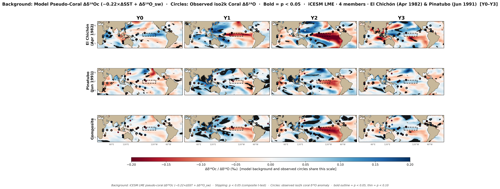

## The question

Do large tropical volcanic eruptions **cause** El Niño, or do they merely **amplify** ongoing warm states?

. . .

- Textbook: *ocean dynamical thermostat* → El Niño–like response [@clement1996ocean; @liu2022land]
- New evidence: the response is **preconditioned** on the initial ENSO state [@dogar2024nao]
- Proxy record: weak but consistent El Niño signal in coral δ¹⁸O networks [@liu2024enso]

## Study design

**Model:** iCESM Last Millennium Ensemble — 4 free-running members, Jan 1950–Dec 2005

**Eruptions:** El Chichón (Apr 1982) and Pinatubo (Jun 1991)

**Proxy network:** 89 tropical iso2k coral sites

**Key outputs:** pseudo-coral δ¹⁸Oc = −0.22 × ΔSST + Δδ¹⁸O_sw (Kim & O'Neil 1997)

. . .

::: {.callout-note appearance="minimal"}
📥  [Download full analysis deck (PPTX)](VolcanoENSO_Analysis_v4.pptx)
:::

---

## Fig 1 — Niño 3.4 index {.scrollable}

The iCESM LME reproduces multi-year ENSO variability across the study period.
Eruption months marked in dashed lines.

{width=100%}

---

## Fig 2 — Post-volcanic ENSO response (SEA)

**Core result:** composite Niño 3.4 shows El Niño–like warming peaking ~12–18 months post-eruption.

{width=100%}

---

## Fig 3 — Model vs. observed ONI

iCESM LME ensemble mean tracks the observed NOAA ONI DJF anomaly in sign and timing for both eruptions.

{width=100%}

---

## Fig 4 — Spatial structure (Y0–Y3 composite)

SST (top) and δ¹⁸O_sw (bottom) composite mean for eruption years 0–3.
El Chichón | Pinatubo | multi-eruption composite.

{width=100%}

---

## Fig 5 — Monthly lag evolution

SST at +6, +12, +18, +24 months post-eruption.
The El Niño–like central/eastern Pacific warming builds through +12 and peaks near +18 months.

{width=100%}

---

## Fig 6 — Annual SST Y0–Y3

Calendar-year composite SST anomaly. Stippling = p < 0.05 (one-sample t-test, n = 4 members).

{width=100%}

---

## Fig 10 — ENSO correlation within eruption windows {.scrollable}

Background: r(SST, Niño 3.4) within Y−3 to Y+7 window.
Circles: observed iso2k Δδ¹⁸O (mean Y0–Y7); bold = p < 0.05.

{width=100%}

---

## Pre-conditioning: setup {.scrollable}

The 4 iCESM members are free-running — they sample different pre-eruption ENSO states independently,
providing a natural test of the @dogar2024nao hypothesis.

## Fig 12 — Pre-eruption ENSO state per member

24 months pre-eruption Niño 3.4, coloured by initial state.
Grey band = 6-month classification window.

{width=100%}

---

## Fig 13 — Peak post-volcanic response vs. pre-conditioning

Members preconditioned in La Niña states tend to produce larger post-volcanic El Niño anomalies.

{width=100%}

---

## Fig 14 — Pre-conditioning SEA

SEA traces coloured by pre-eruption ENSO state (red = El Niño, grey = neutral, blue = La Niña).

{width=100%}

---

## Fig 15 — Regional teleconnections

Multi-eruption composite SEA across 8 ENSO-linked ocean regions.
The Equatorial Atlantic signal tests the Khodri et al. (2017) aerosol–monsoon pathway.

{width=100%}

---

## Model–proxy comparison {.scrollable}

Do the iCESM pseudo-coral δ¹⁸O anomalies match the observed iso2k coral record?

## Fig 18 — Spatial comparison (Y0–Y3)

Background = model pseudo-coral field. Circles = observed iso2k δ¹⁸O. Bold outlines p < 0.05.

{width=100%}

---

## Fig 22 — Time series comparison (composite)

Model ensemble mean ± 1σ vs. observed iso2k coral δ¹⁸O anomaly, Y0–Y7 post-eruption.

{width=100%}

---

## Fig 23 — Proxy skill map

Pearson r between model pseudo-coral and observed iso2k at each site.
Bold outlines = model skill p < 0.05 AND observed p < 0.05.

{width=100%}

---

## Summary

1. iCESM LME reproduces the observed post-volcanic El Niño–like Niño 3.4 response in sign and timing
2. Pre-eruption ENSO state modulates the amplitude of the response — consistent with @dogar2024nao
3. Pseudo-coral δ¹⁸O tracks the SST signal at most tropical iso2k sites (skill r > 0 at majority of sites)
4. The Equatorial Atlantic shows a distinct post-volcanic signal consistent with the Khodri et al. (2017) aerosol–monsoon teleconnection pathway

. . .

**Next:** variance partition (forced vs. internal), expanded eruption set, journal submission

---

## References {.scrollable}

::: {#refs}
:::
