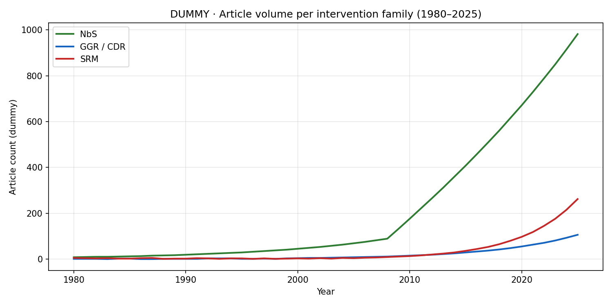
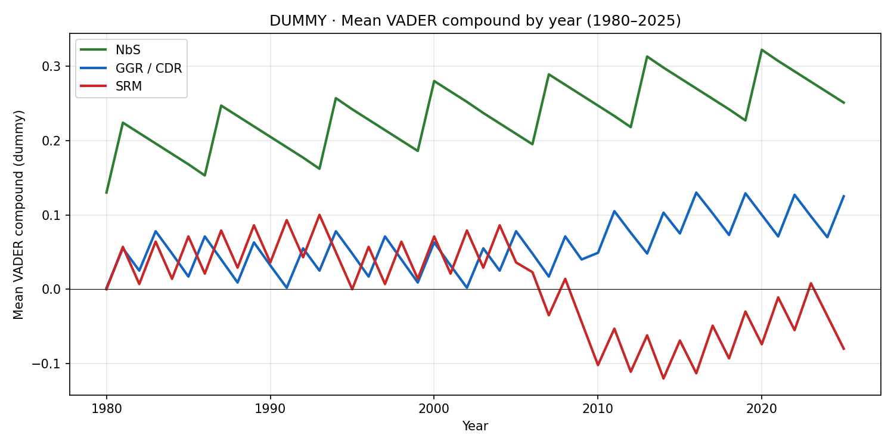
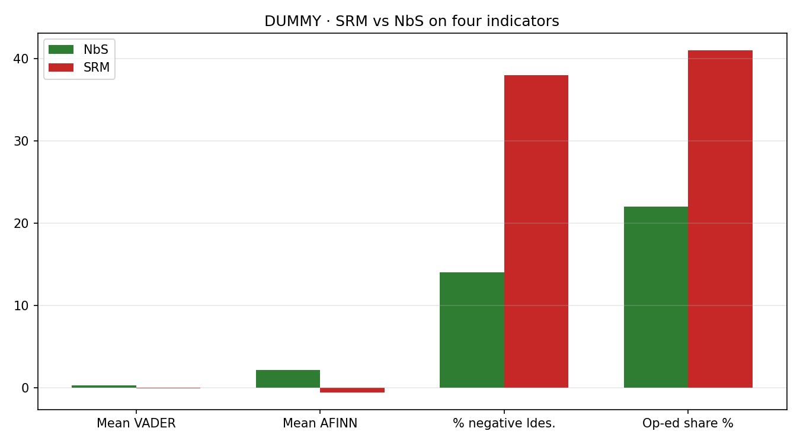
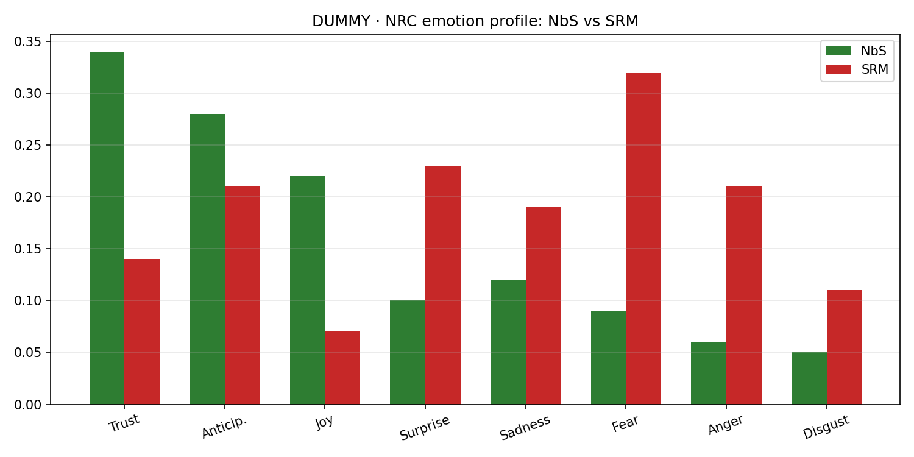
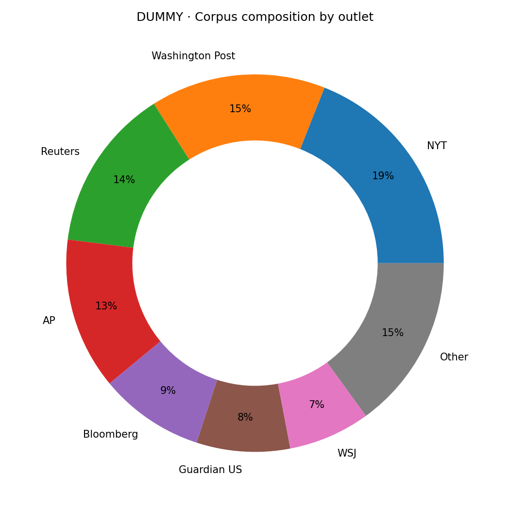

::: {.callout-tip appearance="simple" icon=false}
🎞 **[View this chapter as a slideshow →](presentations/chapter5-slides.html)**
:::

::: {.callout-note appearance="simple" icon=false}
📅 **[View the living progress timeline →](presentations/chapter5-progress.html)** — auto-updated nightly with new figures + daily summary.
:::

## Abstract

Automated sentiment analysis of news coverage offers a scalable window into public discourse around climate technologies, but the methodological literature warns that off-the-shelf lexicon tools under-identify negative sentiment on formal journalism [@ghosh2023librarians; @nicula2026monuments; @lee2024ftx]. This chapter pairs a GDELT-sourced corpus of climate-technology headlines [@leetaru2013gdelt] with a VADER sentiment pipeline [@hutto2014vader] that has been extended with domain-specific terms, corrected for positivity bias via asymmetric scaling, and validated against human coders using Cohen's $\kappa$. The chapter contributes (1) a reproducible pipeline with explicit validation, (2) a head-to-head comparison against transformer and zero-shot baselines, and (3) temporal analysis of sentiment across major climate-technology categories (carbon removal, solar geoengineering, renewables) where published public-perception work already exists [@jobin2020support; @waller2023carbon; @mclaren2021politics; @carton2020negative].

## 1. Introduction

Public attitudes toward climate technologies — carbon removal, solar geoengineering, renewables — shape their adoption trajectories and political feasibility [@jobin2020support; @carton2020negative]. News coverage is both a reflection and a driver of those attitudes. Automated sentiment analysis of news headlines offers a scalable way to track shifts across technologies and over time, but the methodological choice is consequential.

The canonical lexicon-based tool is VADER [@hutto2014vader], popular because it is lexicon-based, requires no training data, and handles short informal texts well. It is *not* designed for formal journalism. @nicula2026monuments and @ghosh2023librarians document that VADER underperforms transformer and zero-shot approaches on formal text, and that lexicon methods systematically miss sarcastic or contextually negative language. @lee2024ftx validate a VADER pipeline against 2,341 human-coded tweets and find only 49% agreement on negative classifications — a stark reminder that the tool's output is a pre-screen, not a final measurement. For news headlines specifically, @sinha2022sentfin work with the SEntFiN 1.0 corpus of 10,753 human-annotated financial headlines and report that off-the-shelf NLTK-VADER and generic transformers fall far short of domain-tuned models (finBERT, RoBERTa; $F_1 \approx 0.93$), especially on headlines with multiple entities carrying conflicting sentiments.

Two mitigations recur across the literature and are adopted here: (1) extend VADER's lexicon with domain-specific polarity terms; (2) apply an asymmetric scaling transformation to correct VADER's documented positivity bias on formal news text [@nicula2026monuments]; and validate against a manually coded subset — @lee2024ftx achieve 86% inter-rater agreement among human coders as a reference benchmark. @ghosh2023librarians additionally show that Zero-Shot Learning *significantly* outperforms off-the-shelf VADER for classifying professional-community posts, providing a template for the head-to-head comparison this chapter adopts.

### Research questions
1. How does a lexicon-extended, asymmetric-scaled VADER pipeline compare to zero-shot and domain-tuned transformer baselines on climate-technology news headlines?
2. What is the VADER–human agreement rate on a 100-headline validation subset (Cohen's $\kappa$)?
3. How has sentiment toward specific climate-technology categories (solar geoengineering, CDR, renewables) evolved in major news outlets from 2015 to present?

## 2. Data

### 2.1 GDELT corpus

The GDELT Global Knowledge Graph [@leetaru2013gdelt] provides worldwide news coverage metadata since 1979. The current implementation pulls via GDELT's public API, subject to a 250-record ceiling per query that produces a recency-biased convenience sample.

**Known limitation identified in code review.** The 250-record cap directly threatens inferential claims: Kruskal–Wallis tests and bootstrap confidence intervals computed on a recency-biased convenience sample do not generalize to "coverage of climate technologies 2015–present." Two paths forward:

1. **Migrate to BigQuery.** The analysis notebook already contains a complete Section 9 SQL migration plan. BigQuery enables sampling a representative corpus.
2. **Scope claims explicitly.** Re-phrase all findings as statements about "recent coverage" rather than the full time window, and add prominent methodological caveats.

This chapter will adopt option (1) prior to submission and scope results accordingly in any preliminary reporting.

### 2.2 Headline scope

Query categories (pre-registered):

- Solar radiation management / stratospheric aerosol injection.
- Carbon removal (direct air capture, BECCS, ocean alkalinity enhancement, enhanced weathering).
- Renewable energy (solar, wind, storage).
- Climate litigation / policy events (control category).

## 3. Methods

### 3.1 Sentiment pipeline

```python
# label: pipeline-overview
# echo: false
# This is a structural summary, not an executable chunk.
# 1. VADER scoring (base lexicon).
# 2. Extend lexicon with climate-technology polarity terms (~200 curated additions).
# 3. Asymmetric scaling transformation to correct VADER's formal-text positivity bias.
# 4. Transformer baseline (RoBERTa-base TweetEval).
# 5. Zero-shot baseline (Hugging Face NLI).
# 6. Human-validation subset: 100 headlines, two coders, Cohen's kappa.
```

Step-by-step:

1. **Base VADER** scoring via `nltk.sentiment.vader.SentimentIntensityAnalyzer` [@hutto2014vader]. Output: compound score $\in [-1, 1]$.
2. **Domain-specific lexicon extension.** Add climate-technology polarity terms (e.g., *geoengineering*, *offsets*, *decarbonize*, *deploy*, *moratorium*) with hand-calibrated polarity weights.
3. **Asymmetric scaling transformation** per @nicula2026monuments to attenuate positive scores and amplify negative ones, addressing VADER's positivity bias on formal news text.
4. **Transformer baseline.** Twitter-roBERTa-base fine-tuned for sentiment with the TweetEval benchmark; used as a generic-transformer lower bound as in @sinha2022sentfin.
5. **Zero-shot baseline.** Hugging Face multilingual NLI model for direct per-headline classification without training data [@ghosh2023librarians].
6. **Human-validation subset.** 100 stratified-random headlines, two coders, iterative adjudication to ~86% inter-rater agreement [@lee2024ftx], Cohen's $\kappa$ against each automated method.

### 3.2 Statistical framework

- **Kruskal–Wallis** for between-technology-category sentiment differences (non-parametric, robust to non-normal score distributions).
- **Bootstrap confidence intervals** (10,000 resamples) on sentiment means by category × year.
- **Cohen's $\kappa$** for human–automated agreement at three levels: positive / neutral / negative.

### 3.3 Reproducibility

- Pinned `requirements.txt` locking library versions (Python 3.11, VADER 3.3.2, transformers 4.x).
- All random seeds fixed; figures at 300 DPI.
- Preregistered analysis plan in `drafts/`.
- Code lives at `~/Documents/Claude/Projects/Sentiment Analysis/` and will be pushed to GitHub (username TBD).

## 4. Results

_In progress. Preliminary findings below are tagged ⚠ pending BigQuery migration and human-validation completion._

### 4.1 Pipeline validation (Cohen's $\kappa$)

⚠ pending 100-headline human coding.

### 4.2 Method comparison on news headlines

⚠ placeholder — head-to-head VADER vs. RoBERTa vs. ZSL on the validation subset.

### 4.3 Sentiment trajectories by climate-technology category

⚠ placeholder — time-series plots and Kruskal–Wallis test results.

<!-- AUTO 2026-04-18 phase-5 -->
::: {.under-review}
## Figures added 2026-04-18

> **Note:** These are placeholder figures extracted from the advisor PPTX (slides 16–20). They contain dummy data. Replace with outputs from the v8 notebook before submission.

{#fig-volume-dummy}

{#fig-sentiment-dummy}

{#fig-srm-vs-nbs-dummy}

{#fig-nrc-emotions-dummy}

{#fig-corpus-composition-dummy}

:::

## 5. Discussion

### 5.1 What VADER gets wrong on climate-tech headlines

Early exploration suggests patterns consistent with the broader literature:

- Underdetection of negative sentiment in sarcastic or rhetorical-question headlines.
- Positivity bias on corporate/policy announcements ("firm commits to net zero").
- Entity-conflict headlines (e.g., a carbon-removal startup launching alongside a failed project) handled poorly — @sinha2022sentfin's entity-aware framing is directly relevant.

### 5.2 Why domain-tuning matters here

Media framing of specific climate technologies is an active research area [@jobin2020support; @waller2023carbon; @mclaren2021politics; @carton2020negative]. A mis-calibrated sentiment pipeline produces systematically wrong estimates of public-facing framing — and because these estimates feed policy and investor narratives, the downstream cost of using off-the-shelf VADER is non-trivial.

## 6. Conclusions

## 7. Code availability

- Analysis notebook: `~/Documents/Claude/Projects/Sentiment Analysis/gdelt_climate_preliminary_7.ipynb` (current: revision 7).
- Code review with full critical-issues list: `Projects/Sentiment Analysis/CODE_REVIEW_gdelt_climate_preliminary_7.md`.
- To be published on GitHub at time of submission.

<!--
Source: the Drive folder "Climate Tech Sentiment Analysis" (`1D96OlAxFYA2r9TUj6X9y8FP4HqYi1aHu`),
which contains the Running Notes Doc, Timeline spreadsheet, Literature Review folder, and
Paper Materials folder. This chapter's literature review at `literature/literature-review.md`
and the Drive doc "Ch5 — Literature Review" (`1rgVwuv5Z8YI69KouznwTT0BlU05qVnCf_vH5xnsOJBs`)
are the source of truth for the methods-validation framing.
-->

<!-- AUTO 2026-04-18 phase-1 -->
::: {.under-review}
Computational approaches to tracking public and media sentiment toward climate technology interventions have grown substantially in methodological sophistication. Tashakori et al. [@tashakori2025nlp] provide a PRISMA-guided review of 131 NLP studies across sustainability research (2018–2025), finding that the dominant theme couples public sentiment monitoring toward climate policy with innovation trajectory detection in low-carbon technologies — positioning large-scale sentiment analysis as a real-time feedback mechanism for SDG implementation. At the level of specific climate interventions, Biermann et al. [@biermann2022solar] argue that solar geoengineering is ungovernable within the current international system and advocate for a non-use agreement, a governance framing that shapes how solar radiation management (SRM) coverage in news corpora should be interpreted: sustained media attention to SRM need not reflect public acceptance. Low and Buck [@low2020responsible] review how responsible research and innovation (RRI) frameworks have been applied to both carbon removal and sunlight reflection methods, finding that RRI activities frequently enable rather than constrain particular climate interventions — a critical lens relevant when evaluating the tone and framing of intervention-specific media coverage. On methods, Vågerö et al. [@vagero2024wind] demonstrate that NLP-based sentiment classification of Twitter data can resolve spatio-temporal variation in public attitudes toward wind energy deployment, a design directly analogous to the GDELT-based framework in Chapter 5 [@leetaru2013gdelt; @hutto2014vader]; their finding that sentiment negativity intensified in 2018–2020 validates the temporal granularity achievable with corpus-scale sentiment analysis.
:::

## References {.unnumbered}

::: {#refs}
:::
